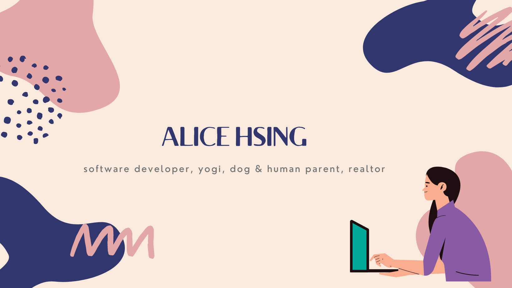

# Alice Hsing ---  @alicehsing

Hi, I'm Alice 👋  :smiley:  --- a hardworking creative self-starter who is passionate about web design and solving problems. I love to cook, hike and do home remodeling projects on the side. Currently, I'm enrolled in a full-time software development training program with @alchemycodelab.

## My Values

* Beginner's mindset and curiosity
* Shared understanding and consensus
* Carve your own path
* Expression as authentic self
* Trust and safety

## How I Work
A great listener who is task-driven and goal-oriented. My motivations are to stabilize and provide clarity through curiosity. Checklists are my absolute favorite :white_check_mark:. If I'm too much in my head, feel free to nudge me to share what's in my brain. :grin: 

## Tech Stack
* Programming Language: HTML, CSS, JavaScript
* Tool: VSCode, Terminal, Github, Slack
<!-- * Web Framework:
* Web Application: 
* Database:
* Web Server:  -->

## Goal for 2022
Stacking my software development skills in the most modern programming languages and development methods. Mastering all the tools I need to be fluent in full stack development. Learn how to work with the full complexity of larger code bases and build systems in a team environment.

> while (!(succeed) = try()));
 

 > I never dreamed I'd grow up to be a **SUPER COOL** **CODER**
 > but here I am KILLIN' IT!

<!--
**alicehsing/alicehsing** is a ✨ _special_ ✨ repository because its `README.md` (this file) appears on your GitHub profile.

Here are some ideas to get you started:

- 🔭 I’m currently working on ...
- 🌱 I’m currently learning ...
- 👯 I’m looking to collaborate on ...
- 🤔 I’m looking for help with ...
- 💬 Ask me about ...
- 📫 How to reach me: ...
- 😄 Pronouns: ...
- ⚡ Fun fact: ...
-->
